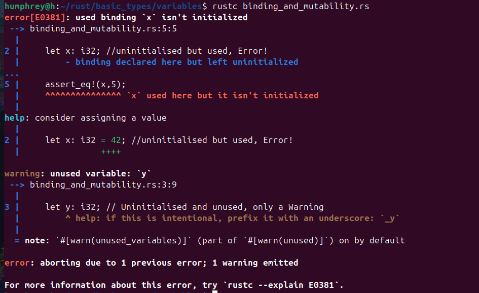
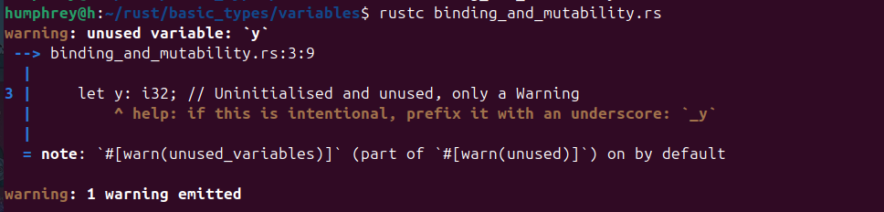

## Rust basics 
* [Binding and mutability](#Binding-and-Mutability)

## Binding and Mutability

A variable can be used only if it has been initialised.

A variable that has not been initialised but used will yeild a warning on compilation

