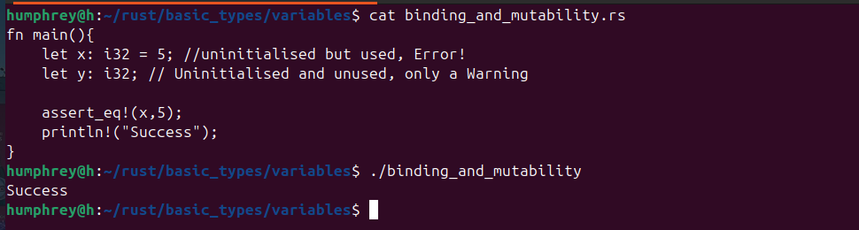
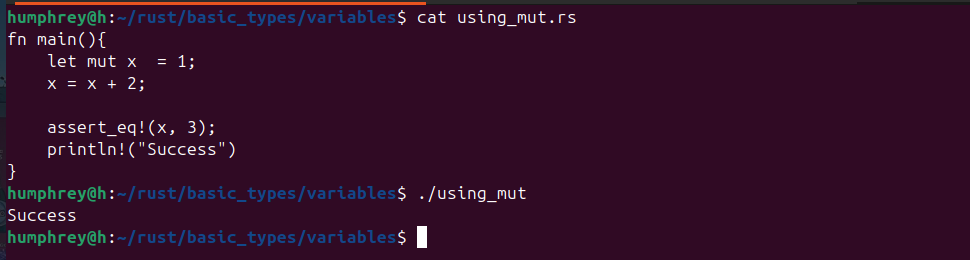
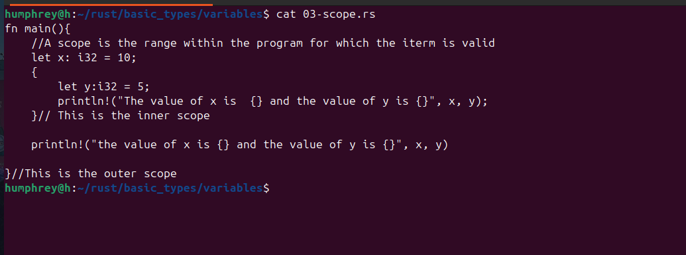
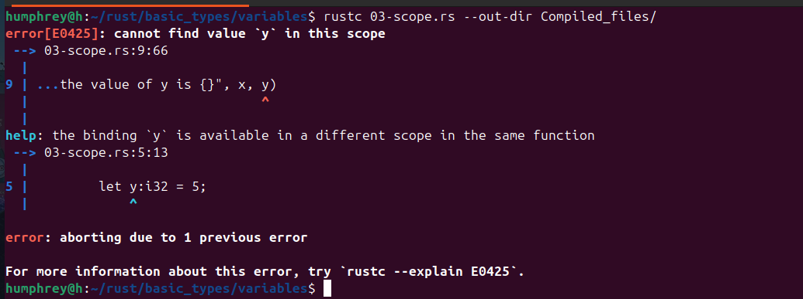
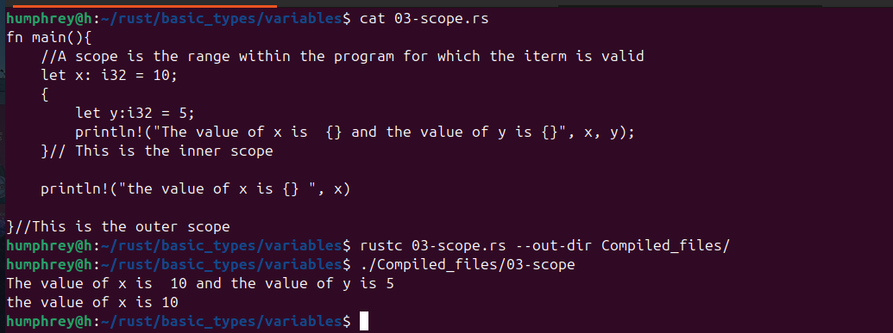

# Rust basics 
* [Binding and mutability](#Binding-and-Mutability)
* [Scope](#Scope)
## Binding and Mutability

A variable can be used only if it has been initialised.

A variable that has not been initialised but used will yeild a warning on compilation

WHEN THE VARIABLES ARE INITIALISED
 

## Use mut to mark a variable as mutable

In rust a variable by its nature is immutable and you have to explicity state that you want a variable to be mutable

## Scope.

Scope of a variable is the block of code in which it is declared.
A variable can  be accessed in its scope.

What it looks like when the y variable is removed on the outer scope

